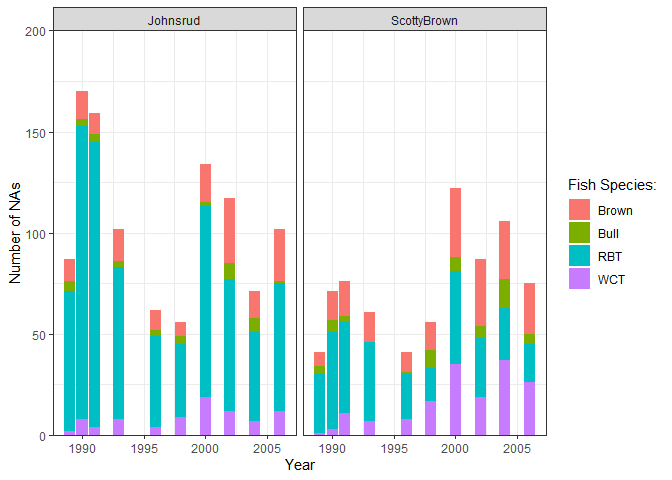
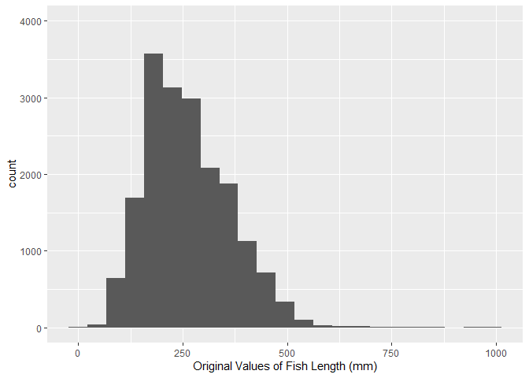
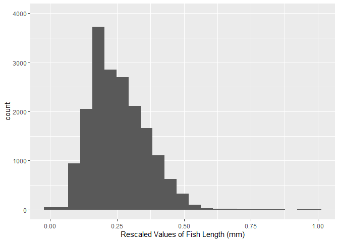

# Lab 8: Fish and Functions
Tyler Busby
2025-05-08

The goal of this lab is learn more about exploring missing data and
writing modular code.

``` r
library(tidyverse)
```

    ── Attaching core tidyverse packages ──────────────────────── tidyverse 2.0.0 ──
    ✔ dplyr     1.1.4     ✔ readr     2.1.5
    ✔ forcats   1.0.0     ✔ stringr   1.5.1
    ✔ ggplot2   3.5.1     ✔ tibble    3.2.1
    ✔ lubridate 1.9.4     ✔ tidyr     1.3.1
    ✔ purrr     1.0.2     
    ── Conflicts ────────────────────────────────────────── tidyverse_conflicts() ──
    ✖ dplyr::filter() masks stats::filter()
    ✖ dplyr::lag()    masks stats::lag()
    ℹ Use the conflicted package (<http://conflicted.r-lib.org/>) to force all conflicts to become errors

``` r
fish <- read_csv("BlackfootFish.csv")
```

    Rows: 18352 Columns: 7
    ── Column specification ────────────────────────────────────────────────────────
    Delimiter: ","
    chr (2): section, species
    dbl (5): trip, mark, length, weight, year

    ℹ Use `spec()` to retrieve the full column specification for this data.
    ℹ Specify the column types or set `show_col_types = FALSE` to quiet this message.

## The Data

This lab’s data concerns mark-recapture data on four species of trout
from the Blackfoot River outside of Helena, Montana. These four species
are **rainbow trout (RBT)**, **westslope cutthroat trout (WCT)**, **bull
trout**, and **brown trout**.

Mark-recapture is a common method used by ecologists to estimate a
population’s size when it is impossible to conduct a census (count every
animal). This method works by *tagging* animals with a tracking device
so that scientists can track their movement and presence.

## Data Exploration

The measurements of each captured fish were taken by a biologist on a
raft in the river. The lack of a laboratory setting opens the door to
the possibility of measurement errors.

**1a. Let’s look for missing values in the dataset. Output ONE table
that answers BOTH of the following questions:**

-   **How many observations have missing values?**
-   **What variable(s) have missing values present?**

> **You should use `across()`!**

``` r
fish |>
  summarise(across(1:7,
                   ~sum(is.na(.))))
```

    # A tibble: 1 × 7
       trip  mark length weight  year section species
      <int> <int>  <int>  <int> <int>   <int>   <int>
    1     0     0      0   1796     0       0       0

**1b. Using `map_int()`, produce a nicely formatted table of the number
of missing values for each variable in the `fish` data that displays the
same information as 1a**

``` r
fish |>
  map_int(~sum(is.na(.)))
```

       trip    mark  length  weight    year section species 
          0       0       0    1796       0       0       0 

**2. Create ONE thoughtful visualization that explores the frequency of
missing values across the different years, sections, and trips.**

``` r
fish |>
  group_by(year, section, species) |>
  summarise(nas = sum(is.na(weight))) |>
  ggplot(aes(x = year, y = nas, fill = species)) +
  geom_col() +
  facet_wrap(~ section) +
  labs(y = "Number of NAs",
       x = "Year",
       fill = "Fish Species:") +
  theme_bw() +
  scale_y_continuous(expand = c(0,0), 
                     limits = c(0, 200))
```

    `summarise()` has grouped output by 'year', 'section'. You can override using
    the `.groups` argument.



## Rescaling the Data

If I wanted to rescale every quantitative variable in my dataset so that
they only have values between 0 and 1, I could use this formula:

</br>

$$y\_{scaled} = \frac{y_i - min\\y_1, y_2,..., y_n\\}{max\\y_1, y_2,..., y_n\\ 
- min\\y_1, y_2,..., y_n\\}$$

</br>

I might write the following `R` code to carry out the rescaling
procedure for the `length` and `weight` columns of the `BlackfoorFish`
data:

``` r
fish <- fish |> 
  mutate(length = (length - min(length, na.rm = TRUE)) / 
           (max(length, na.rm = TRUE) - min(length, na.rm = TRUE)), 
         weight = (weight - min(weight, na.rm = TRUE)) / 
           (max(weight, na.rm = TRUE) - min(weight, na.rm = TRUE)))
```

This process of duplicating an action multiple times can make it
difficult to understand the intent of the process. *Additionally, it can
make it very difficult to spot mistakes.*

**3. What is the mistake I made in the above rescaling code?**

> You accidentally subtracted the minimum length from the maximum weight
> when reducing the scale of weight.

When you find yourself copy-pasting lines of code, it’s time to write a
function, instead!

**4. Transform the repeated process above into a `rescale_01()`
function. Your function should…**

-   **… take a single vector as input.**
-   **… return the rescaled vector.**

``` r
rescale_01 <- function(x) {
  if(!is.numeric(x)) {
    stop("Input vector is not numeric")
  }
  if(length(x) <= 1) {
    stop("Length of the input vector is not greater than 1")
  }
  ((x - min(x, na.rm = TRUE)) / (max(x, na.rm = TRUE) - min(x, na.rm = TRUE)))
}
```

> **Efficiency**
>
> Think about the efficiency of the function you wrote. Are you calling
> the **same** function multiple times? You might want to look into the
> `range()` function.

**5. Let’s incorporate some input validation into your function. Modify
your previous code so that the function stops if …**

-   **… the input vector is not numeric.**
-   **… the length of the input vector is not greater than 1.**

> **Modify Previous Code**
>
> Do not create a new code chunk here – simply add these stops to your
> function above!

## Test Your Function

**6. Run the code below to test your function. Verify that the maximum
of your rescaled vector is 1 and the minimum is 0!**

``` r
x <- c(1:25, NA)

rescaled <- rescale_01(x)
min(rescaled, na.rm = TRUE)
```

    [1] 0

``` r
max(rescaled, na.rm = TRUE)
```

    [1] 1

Next, let’s test the function on the `length` column of the
`BlackfootFish` data.

**7. The code below makes a histogram of the original values of
`length`. Add a plot of the rescaled values of `length`. Output your
plots side-by-side, so the reader can confirm the only aspect that has
changed is the scale.**

> **Warning**
>
> This will require you to call your `rescale_01()` function within a
> `mutate()` statement in order to create a `length_scaled` variable.

``` r
fish |>  
  ggplot(aes(x = length)) + 
  geom_histogram(binwidth = 45) +
  labs(x = "Original Values of Fish Length (mm)") +
  scale_y_continuous(limits = c(0,4000))
```



``` r
fish |>  
  mutate(length_rescaled = rescale_01(length)) |>
  ggplot(aes(x = length_rescaled)) + 
  geom_histogram(binwidth = 0.045) +
  labs(x = "Rescaled Values of Fish Length (mm)") +
  scale_y_continuous(limits = c(0,4000))
```



> **Tip**
>
> 1.  Set the y-axis limits for both plots to go from 0 to 4000 to allow
>     for direct comparison across plots.
>
> 2.  Pay attention to `binwidth`!
>
> 3.  Use a Quarto code chunk option to put the plots side-by-side.

## Challenge: Use Variables within a Dataset

Suppose you would like for your `rescale()` function to perform
operations on a **variable within a dataset**. Ideally, your function
would take in a data frame and a variable name as inputs and return a
data frame where the variable has been rescaled.

**8. Create a `rescale_column()` function that accepts two arguments:**

-   **a dataframe**
-   **the name(s) of the variable(s) to be rescaled**

**The body of the function should call the original `rescale_01()`
function you wrote previously. Your solution MUST use one of the `rlang`
options from class.**

> **Tip**
>
> If you are struggling with this task, I recommend looking back over
> the [data frame
> functions](https://r4ds.hadley.nz/functions.html#data-frame-functions)
> section of R for Data Science!

**9. Use your `rescale_column()` function to rescale *both* the `length`
and `weight` columns.**

> **Warning**
>
> I expect that you carry out this process by calling the
> `rescale_column()` function only ONE time!
